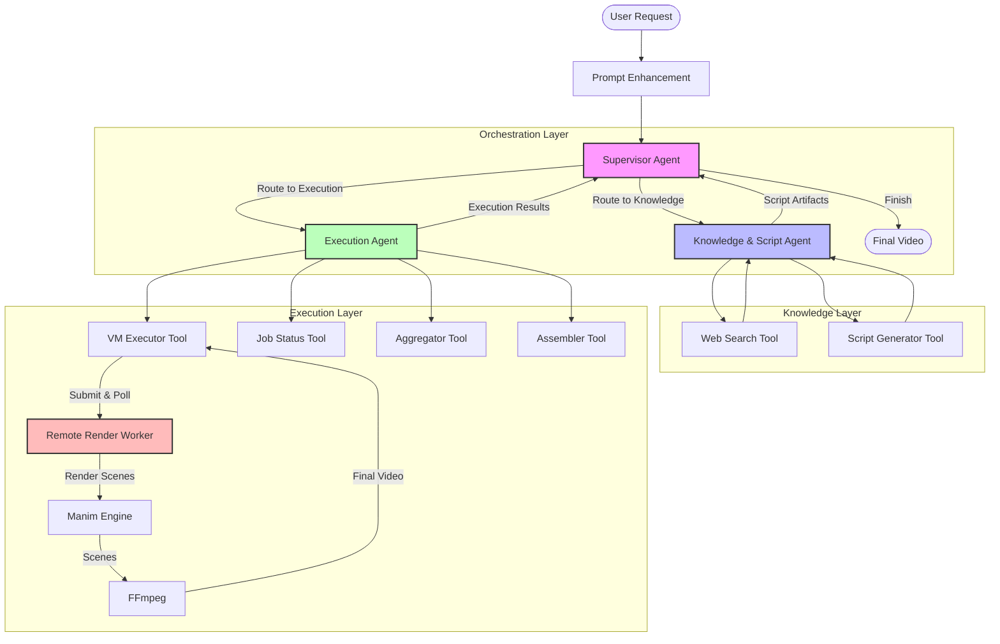

# 🚀 MetaMusk Backend: Multi-Agent Video Generation

> **Autonomous Educational Video Generation System using LangGraph & Manim**

MetaMusk is a sophisticated multi-agent AI system designed to transform simple text prompts into professional, mathematically accurate animation videos. It leverages **LangChain**, **LangGraph**, and the **Manim** engine to research, script, render, and assemble educational content autonomously.


---

## 🧠 System Architecture

The core of MetaMusk is a state-machine workflow orchestrating three specialized AI agents. This separation of concerns allows for high-quality content generation and robust error handling.



### 🤖 The Agents

| Agent | Icon | Role | Responsibilities |
| :--- | :---: | :--- | :--- |
| **Knowledge Agent** | 🎓 | *Professor* | Researches topics, structures 4-scene storyboards, and writes precise Manim Python code. correct LaTeX syntax. |
| **Execution Agent** | 🎬 | *Director* | Validates scripts, manages rendering jobs (Local/VM), aggregates scenes, and creates the final video. |
| **Supervisor Agent** | 🎯 | *Manager* | Coordinates the workflow, routes tasks, handles failures, and manages the global state. |

---

## ✨ Key Features

*   **Hybrid Rendering**: Automatically switches between **Local Rendering** (for dev) and **Remote VM Rendering** (for production speed).
*   **Self-Healing Code**: The Knowledge Agent iteratively fixes Manim errors (e.g., LaTeX syntax, geometry bugs) before execution.
*   **Smart Caching**: Caches generated scripts and rendered scenes to optimize performance.
*   **Full Pipeline**: From prompt -> script -> scene rendering -> video assembly (FFmpeg) -> final MP4.

---

## 🛠️ Installation & Setup

### Prerequisites
*   **Python 3.10+**
*   **[uv](https://github.com/astral-sh/uv)** (Recommended package manager)
*   **System Dependencies**:
    ```bash
    sudo apt install ffmpeg libcairo2-dev libpango1.0-dev pkg-config
    ```

### 1. Installation
```bash
git clone https://github.com/YourRepo/MetaMusk.git
cd backend
uv sync
```

### 2. Configuration
Create a `.env` file from the example:
```bash
cp .env.example .env
```
Fill in your API keys:
*   `GOOGLE_API_KEY`: For Gemini 1.5 Pro (The brain)
*   `VM_RENDER_ENDPOINT`: URL of your render worker (e.g., `http://34.100.234.137:8080` or `http://localhost:8080`)

### 3. Running the Server
```bash
uv run uvicorn app.main:app --reload
```
The API is now live at `http://localhost:8000`.

---

## 🏃 Video Generation Modes

### A. Local Rendering (Development)
If you have `manim` and `ffmpeg` installed locally, the system will render videos on your machine.
*   **Pros**: Easy to debug, no external dependencies.
*   **Cons**: Slower, blocks your CPU.

### B. VM Rendering (Production)
Configure `VM_RENDER_ENDPOINT` to point to a high-performance VM running the `render_worker`.
*   **Pros**: Fast, scalable, non-blocking.
*   **Cons**: Requires deploying `render_worker` to the VM.

> **Note**: If the VM is unreachable, the system falls back to **Mock Mode** (simulated success) to prevent crashes. Check the logs if you see "Success" but no video file.

---

## 🔌 API Reference

### Generate Video
`POST /agents/generate-video`
```json
{
  "concept": "Visual proof of the Pythagorean theorem",
  "user_id": "user-123"
}
```

### Prompt Enhancement
`POST /prompt/enhance`
Enhances simple queries into detailed prompt specifications.

### Health Check
`GET /health`

---

## 📂 Project Structure

```
backend/
├── app/
│   ├── agents/           # Agent Logic
│   │   ├── knowledge_agent.py
│   │   ├── execution_agent.py
│   │   └── supervisor_agent.py
│   ├── tools/            # Capability Toolkit
│   │   ├── script_generator.py   # LLM -> Manim Code
│   │   ├── vm_executor.py        # Rendering Logic
│   │   └── aggregator.py         # FFmpeg Tools
│   ├── graph/            # LangGraph Workflow Definition
│   └── main.py           # FastAPI Entrypoint
├── render_worker/        # Standalone Worker Service (for VM)
│   └── main.py
└── media/                # Generated Video Output
```

---

## 📄 License
MIT License.
